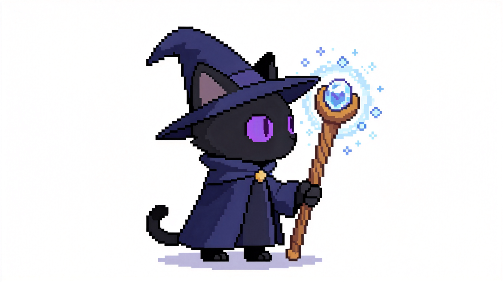
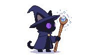
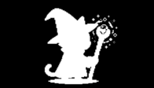
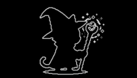
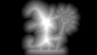
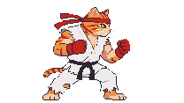
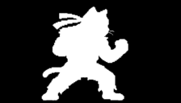
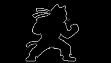

# PixelClean

将 AI 生成的"伪像素画"（大尺寸图像但具有像素块结构）转为真正的小尺寸游戏像素图。  
支持PNG->PNG 和 MP4->GIF


| 原始图片 (2848x1600) | 提取结果 (196x112) |
|:---:|:---:|
|  |  |

| Alpha 遮罩 | 边缘图 | SDF 图 |
|:---:|:---:|:---:|
|  |  |  |

| 视频像素 GIF (224x128) | Alpha 遮罩 | 边缘图 |
|:---:|:---:|:---:|
|  |  |  |


AI 图像生成工具（即梦、PixelLab、MidJourney 等）生成的"像素画"通常是高分辨率大图，虽然看起来像像素风格，但实际尺寸远大于游戏所需的像素图。PixelClean 自动降采样为真正的小尺寸像素图，同时生成 alpha 遮罩、边缘图、SDF 等辅助图，可直接用于游戏引擎渲染。

## 功能特性

- **全自动处理** — 一个命令完成全部流程：调色板提取 → 去噪 → 尺寸检测 → 降采样 → 去背景 → 辅助图
- **智能尺寸检测** — 自动识别像素块结构，无需手动指定小图尺寸
- **Lab 色彩空间调色板** — 精确提取最小调色板，去除 AI 生成的噪声颜色
- **投票法降采样** — 每个像素块投票选出主色，忠实还原像素画特征
- **智能去背景** — 匹配左上角背景色，BFS 扩展自动清理边缘相似色
- **辅助图输出** — 同时生成 alpha 遮罩、边缘图、SDF 图，方便游戏引擎直接使用
- **视频支持** — 自动拆帧、并发处理、帧去重，输出 GIF 动画 + 辅助图 GIF
- **单文件 exe** — NativeAOT 编译，无需安装 .NET 运行时

## 使用方法

### 懒人用法（拖拽）

直接把 PNG 图片或 MP4 视频文件**拖拽到 `pixanalyze.exe` 上**即可。

会在源文件旁边自动生成提取结果，无需打开命令行。

### 命令行用法

```
pixanalyze <文件路径> [选项]
```

自动识别图片和视频，无需指定类型。

**处理图片：**

```bash
pixanalyze cat_mage.png
```

输出文件（自动生成在源文件旁边）：

| 文件 | 说明 |
|------|------|
| `cat_mage_small.png` | 提取的像素小图 |
| `cat_mage_small_alpha.png` | Alpha 遮罩（白=前景，黑=背景） |
| `cat_mage_small_edge.png` | 边缘图（约 1 像素宽度边界线） |
| `cat_mage_small.json` | 元数据（尺寸、调色板等） |

加 `--sdf` 可额外输出 SDF 距离场图。

**处理视频：**

```bash
pixanalyze attack.mp4
```

输出 GIF 动画 + 辅助图 GIF + JSON，用法与图片完全一致。

**用已有调色板处理视频：**

先处理静态图得到调色板（在 JSON 中），再用调色板处理视频，保持颜色一致：

```bash
pixanalyze character.png
pixanalyze attack.mp4 --palette <JSON中的palette字段> --max-expand 0
```

### AI 协作用法

PixelClean 专为 AI 工作流设计。让 AI（如 Claude）阅读本仓库的 `forai.md`，即可自动学会调用：

```
请阅读 pixelclean/forai.md，然后用 pixanalyze 处理这个视频
```

AI 会自动：
- 判断输入是图片还是视频
- 选择合适的参数
- 解析输出 JSON 中的调色板用于后续视频处理

## 安装

### 直接使用

`publish/` 目录包含所有win64文件，无需安装：
如果你使用其它平台，需适当移植。这活叫ai就能干。

```
publish/
├── pixanalyze.exe                       # 主程序（NativeAOT 单文件）
├── tool/ffmpeg.exe                      # 视频拆帧工具
└── tool/spritefusion-pixel-snapper.exe  # 尺寸探测工具
```

### 从源码构建

需要 .NET 10.0 SDK + Visual Studio C++ 工具链（NativeAOT 需要）。

```bash
# 编译
dotnet build src/PixelClean

# 发布（需要 MSVC 环境）
publish_pixelclean_win64.bat
```

## 命令行参数

```
pixanalyze <input> [选项]

参数:
  --algorithm <cluster|greedy>  调色板算法（默认 cluster）
  --max-colors <N>              调色板最大颜色数（默认 64）
  --threshold <N>               颜色合并阈值 ΔE（默认 15.0）
  --size <WxH>                  小图尺寸（可选，不指定则自动检测）
  --palette <hex>               参考调色板（可选，不传则自动提取）
  --expand-threshold <N>        调色板扩展阈值 ΔE（默认 20.0）
  --max-expand <N>              最大扩展颜色数（默认 16）
  --no-remove-bg                不删除背景（默认自动删除）
  --sdf                         输出 SDF 图（默认关闭）
  --fps <N>                     拆帧帧率（默认视频原始帧率，仅视频）
  --dup-threshold <N>           帧去重相似度阈值（默认 0.99，仅视频）
  --keep-frames                 保留 ffmpeg 拆帧原始文件（仅视频）
  -o <file>                     输出文件路径（可选，默认从输入名推导）
```

### 输出文件命名

**图片输入：**

| 条件 | 输出 |
|------|------|
| 始终 | `{name}_small.png` — 像素小图 |
| 去背景 | `{name}_alpha.png` — Alpha 遮罩 |
| 去背景 | `{name}_edge.png` — 边缘图 |
| 去背景 + `--sdf` | `{name}_sdf.png` — SDF 图 |
| 始终 | `{name}_small.json` — 元数据 |

**视频输入：**

| 条件 | 输出 |
|------|------|
| 始终 | `{name}.gif` — 像素 GIF |
| 去背景 | `{name}_alpha.gif` — Alpha GIF |
| 去背景 | `{name}_edge.gif` — 边缘 GIF |
| 去背景 + `--sdf` | `{name}_sdf.gif` — SDF GIF |
| 始终 | `{name}.json` — 元数据 |

### 辅助图说明

**Alpha 遮罩** — 二值图，白=前景，黑=背景，双线性插值缩小。

**边缘图** — 腐蚀 + XOR 提取前景边界轮廓，约 1 像素块宽度，用于描边。

**SDF 图** — 有符号距离场，灰度编码：128=边界，>128=内部，<128=外部，每级约 1/8 像素距离，用于柔和阴影、描边等。

## 许可

MIT License
